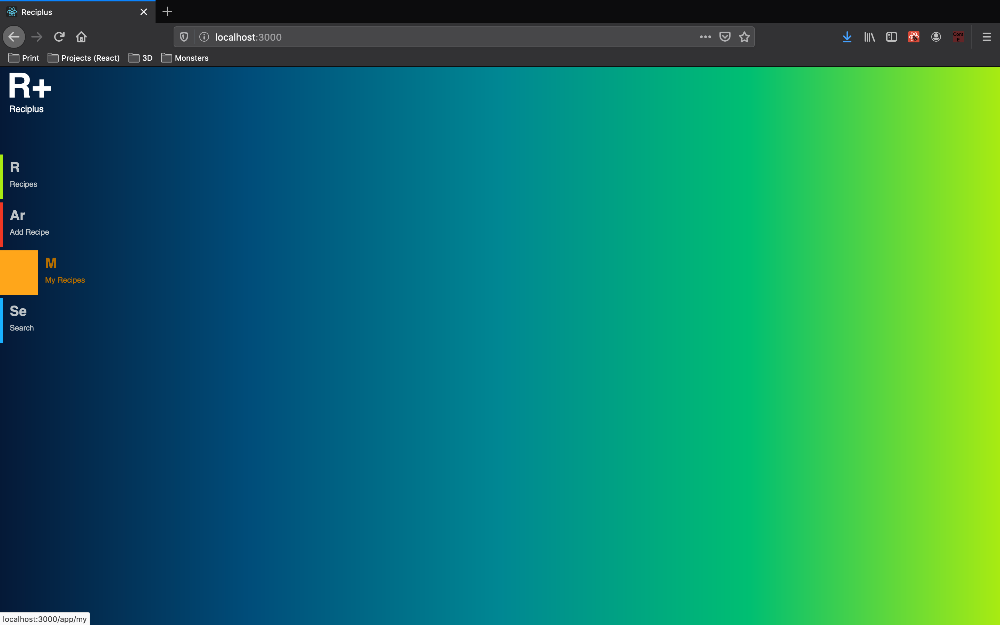
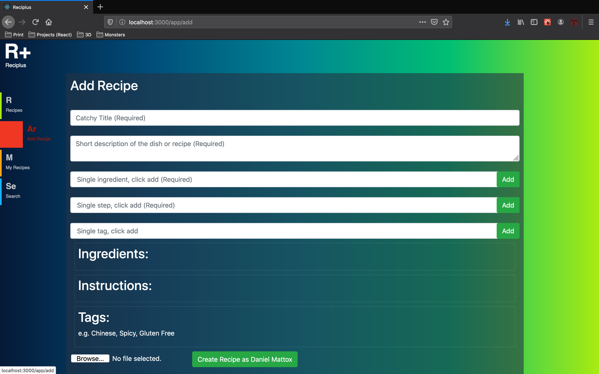

# Reciplus

## SaaS platform for recipe, ingredient, and allergen management built on *React* and *Express*

- Run Yarn in /api and and /client directories
- I'll add docker compose soon, but you need mongo latest for now, eventually Nginx
- I'll add a single start script soon:
- *yarn start* in /api
- *yarn start* in /client

